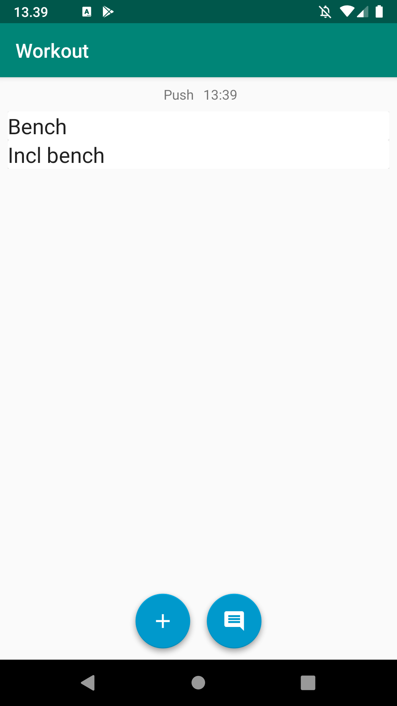
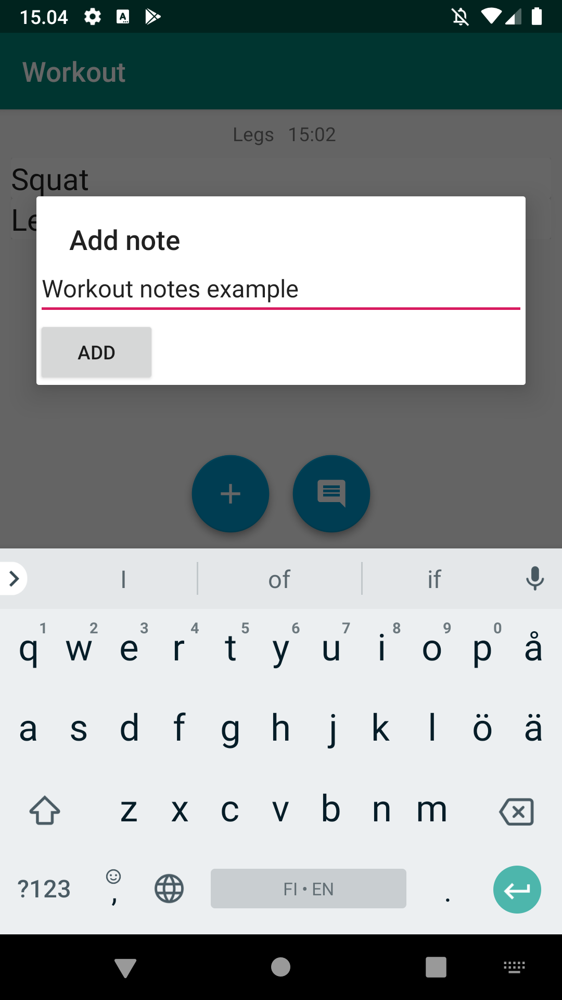

# gymlogger

Android app to log workouts

## Features

- Log workouts easy
- Log worksets easy
- Log workout time
- Workout notes

## Intuitive use

- Train instantly
- Autopick next training
- Minimum typing needed

## Screenshots

